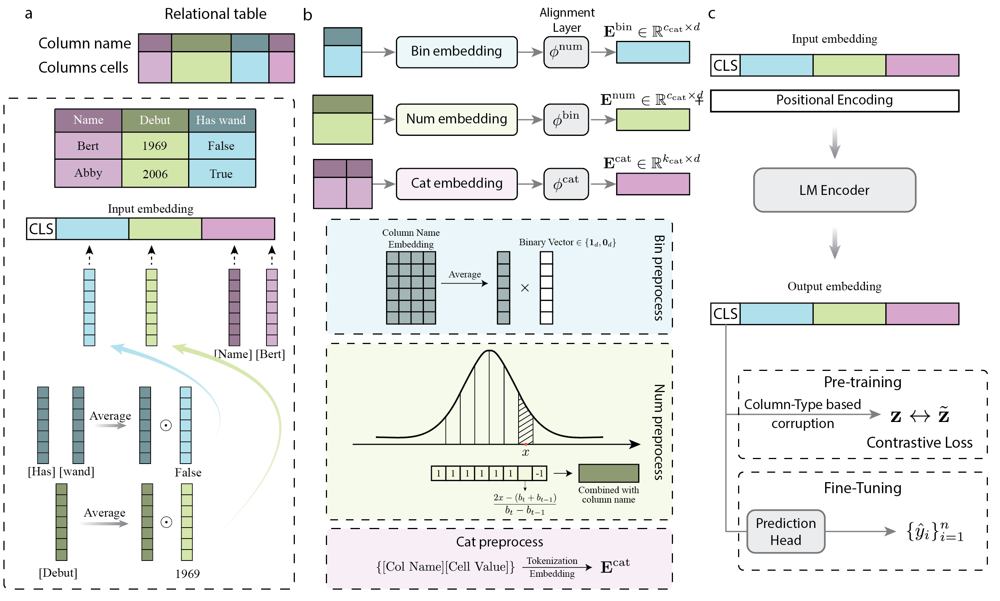

# Language Models Are Good Tabular Learners

This is the official implementation of "Language Models Are Good Tabular Learners".

## Introduction

TLDR: Transformer-based language models have become the de facto standard in natural language processing. However, they underperform in the tabular data domain compared to traditional tree-based methods. We postulate that there are two factors encumbering the elicitation of the full potential of language models: (1) heterogeneity of tabular data; (2) feebleness in interpreting numerical values. Based on this postulation, we propose a method dubbed Tabular Domain Transformer (TDTransformer). TDTransformer has distinct embedding processes for different types of columns. Alignment layers for different types of columns transform column embeddings to a uniform embedding space. Besides, TDTransformer adapts piece-wise linear encoding for numerical values in transformer-based architectures. We examine the proposed method on 76 real-world tabular classification datasets from the standard OpenML benchmark. The comparison with baseline methods reveals the superiority of the proposed method.

<div align="center">
  
  <p align="center"><b>Overview of TDTransformer framework.</b> We design distinct embedding processes for categorical, numerical and binary columns.</p>
</div>

## Setup Environment

1. Create virtual environment

```bash
conda create -n tdtransformer python=3.10
conda activate tdtransformer
```

2. Install required packages

```bash
pip install -r requirements.txt
```

3. Datasets

Datasets will be automatically downloaded from [OpenML benchmark](https://www.openml.org/).


## Run Code

1. Run a single dataset

To run the experiment on dataset id 44 from the OpenML benchmark using random seed 1 and GPU 0, use

```bash
bash scripts/launch.sh 44 tabtransformer 1 output configs/tabtransformer/dev.yaml 0
```

2. Run a batch of datasets

To set datasets and seed, change the loop in [scripts/batch.sh](scripts/batch.sh). By default, the output directory is `outputs`. Running batch experiments uses

```bash
bash scripts/batch.sh tabtransformer
```

## License

TDTransformer is released under the Apache License. Please see the [LICENSE](LICENSE) file for more information.


## Citation

If you find this repo is helpful, please kindly consider citing our work:
```
@article{huang2025tdtrasnformer
    title={Language Models Are Good Tabular Learners},
    author={Huang, Zhenhan and Srinivas, Kavitha and Samulowitz, Horst and D'Souza, Niharika S. and Aggarwal, Charu C. and Chen, Pin-Yu and Gao, Jianxi},
    journal={Transactions on Machine Learning Research},
    year={2025}
}
```

## Acknowledgement

Our work is built based on [TransTab](https://github.com/RyanWangZf/transtab) repository.
